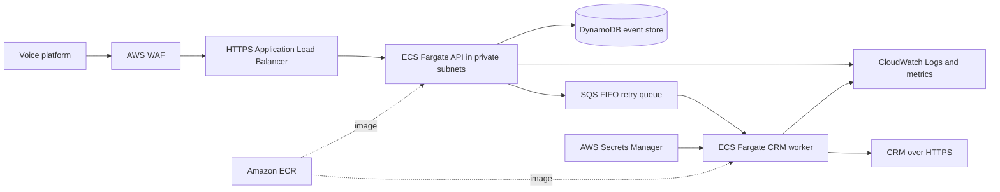

# Predixion AI Assignments

The workspace contains Assignments 1 through 4. From the repository root, run each Part B as follows.

## Assignment 1 - Collections Ledger

```powershell
cd assignment1
python -m pip install -r requirements.txt
python -m pytest -q
```

Part B source is in `assignment1/ledger/`.

## Assignment 2 - Dialer Campaign Analytics

```powershell
cd assignment2
python -m pip install -r requirements.txt
python -m pytest -q
```

Open `assignment2/analysis.ipynb` in VS Code and choose **Run All**. It generates the seeded CSVs and writes the chart and Collections Head memo under `assignment2/outputs/`.

## Assignment 3 - Fix and Ship

```powershell
cd assignment3
python -m pip install -r requirements.txt
python -m pytest tests -q
```

The temporary interview demo is deployed in `ap-south-1` at [the health endpoint](http://predixion-call-webhook-alb-1031799190.ap-south-1.elb.amazonaws.com/health). It is HTTP-only on public subnets and is not safe for real borrower data. It uses one ECS task and no CRM worker. Tear it down after the interview from `assignment3/terraform` with:

```powershell
$env:LOCALAPPDATA\Programs\Terraform\terraform.exe destroy -var-file=terraform.demo.tfvars
```

The default Terraform configuration remains available for the secure HTTPS/private-subnet deployment when ACM, private subnet, CRM secret, and repository inputs are provided. The OIDC workflow is at `.github/workflows/deploy-assignment3.yml`. Part A is labeled no-AI and remains for independent completion.

### Assignment 3 Architecture

The diagram shows the intended secure deployment. The temporary interview demo differs: it uses HTTP and public subnets, runs only the API task, and has no CRM worker.



## Assignment 4 - Collections Assistant

```powershell
python -m pip install -r requirements.txt
python eval.py
python -m pytest tests -q
```

The Assignment 4 files are at the GitHub repository root; in this workspace they are under `assignment4/`.

`demo.py` gives you a guided terminal walkthrough of four scripted scenarios and prints the tool results; it needs no API key. `eval.py` runs deterministic checks with a fake LangChain model, not live model inference.

To run a live Gemini text session in PowerShell, enter a **new, replacement key** when prompted. Do not reuse the key previously pasted into chat; revoke that key first.

```powershell
$env:LLM_PROVIDER = "google"
$secureKey = Read-Host "New Gemini API key" -AsSecureString
$keyPointer = [Runtime.InteropServices.Marshal]::SecureStringToBSTR($secureKey)
try {
	$env:GOOGLE_API_KEY = [Runtime.InteropServices.Marshal]::PtrToStringBSTR($keyPointer)
	python agent.py
} finally {
	Remove-Item Env:GOOGLE_API_KEY -ErrorAction SilentlyContinue
	Remove-Item Env:LLM_PROVIDER -ErrorAction SilentlyContinue
	[Runtime.InteropServices.Marshal]::ZeroFreeBSTR($keyPointer)
}
```

The default model is `gemini-2.5-flash`; override it with `GEMINI_MODEL` if needed. To use OpenAI instead, set `LLM_PROVIDER=openai` and `OPENAI_API_KEY`. Keep keys in environment variables or a secret manager; never commit them. Live calls can incur provider charges.

An OpenAI key enables live model calls; it does **not** make this mock-backed demo production-ready. The in-memory accounts are test data, and live model behavior is not guaranteed.

## Design and enforcement

- `agent.py` creates a LangChain v1 `create_agent` with an in-memory checkpointer. Reusing a `thread_id` preserves conversation messages across turns during the process lifetime.
- The account repository is seeded in memory with one overdue loan and one paid loan. Replace it with a secure persistent store for any real deployment.
- Identity verification gates `get_account`, promise recording, and callbacks. The `get_account` tool never returns balance, minimum due, DPD, or status before verification.
- Promise amount, account status, and the inclusive today-through-today-plus-seven-days date window are checked inside `record_promise_to_pay`.
- Callback timestamps must include a timezone and are converted to IST before checking the 08:00 inclusive to 19:00 exclusive window.
- A deterministic safety gate intercepts common English, Hindi, and Hinglish dispute, claimed-payment, hardship, and abusive-call phrases and invokes the escalation tool before the model can negotiate. Tools also block payment/callback actions for escalated accounts.
- The system prompt sets tone and tool-use policy. The action tools and pre-model safety gate enforce the critical business rules; the prompt alone is not treated as a security boundary.
- Identity verification is scoped to a unique assistant session, and one assistant instance is bound to one conversation thread. Create a fresh assistant instance for each caller/session.
- Prompt-override patterns are rejected before the model call. Provider/model exceptions return a neutral human-handoff response; logs include only a generated session ID and exception type.
- There is intentionally no tool for marking a loan settled. Borrower text cannot add tools or grant administrative authority.

## Evaluation

`eval.py` executes nine scripted scenarios and judges tool calls and resulting mock state, not exact wording: valid PTP across turns, below-minimum offer, dispute, already-paid account, wrong DOB, prompt injection, 22:00 callback, claimed payment, and hardship. It prints PASS/FAIL for each and returns a non-zero exit code on any failure.

## Known limits

- Do not connect this demo to real borrower accounts. Before production, replace mock data and in-memory checkpoints with encrypted, access-controlled persistent storage; use a verified identity provider and durable audit/idempotency controls; require explicit borrower confirmation before recording a promise; and connect escalation to a staffed human queue.
- Add authentication, authorization, identity-attempt throttling, retention/deletion policy, privacy review for sending utterances to a model provider, secret-manager-backed API keys, rate limits, monitoring, and incident procedures.
- The safety phrase detector is a deterministic starter list, not a complete Hindi/Hinglish classifier. A production system needs a broader evaluated classifier, human review paths, and regular adversarial testing.
- The in-memory checkpoint and accounts disappear when the process exits. Production needs encrypted, access-controlled persistence, retention limits, and audit logging.
- A live Gemini or OpenAI model may fail to call the right tool or follow style guidance. Tool checks still reject invalid actions; production should add model/version pinning, rate limits, timeouts, fallback behavior, and monitored evaluations.
- The mock account IDs and DOBs are test data only. Never use this storage pattern or mock identity fields with real borrower information.

Part A is labeled no-AI in the brief and is intentionally left for independent completion.
